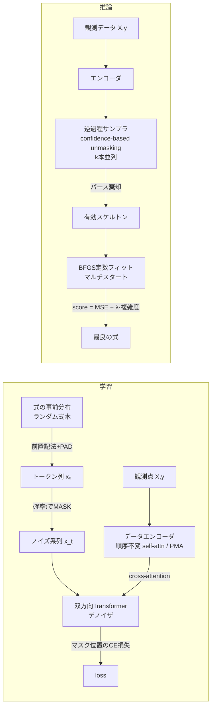

# diffsr — マスク型離散拡散によるシンボリック回帰

観測データ (X, y) から明示的な数式（例: `y = 2*x0 + 1`）を自動発見するプロトタイプ。
数式を**前置記法トークン列**として表現し、**吸収状態（マスク型）離散拡散モデル**で
データに条件付けられたスケルトン（定数プレースホルダ `C` 入り）を生成、
定数は生成後に **BFGS** でフィッティングする。

- 設計の根拠と先行研究: [SPEC.md](SPEC.md)
- 実装計画と検証計画: [PLAN.md](PLAN.md)
- 実験記録（失敗も含む）: [EXPERIMENTS.md](EXPERIMENTS.md)

## アーキテクチャ



## セットアップ

```bash
pip install torch --index-url https://download.pytorch.org/whl/cpu  # または pip install torch
pip install numpy scipy sympy scikit-learn gplearn pytest
pip install -e . --no-deps
```

CPU のみで動作する（GPU 不要）。

## 実行例

```bash
# 1. 最小構成（1変数）の学習: CPU 約3分
python scripts/train.py --config tiny1var --out runs/tiny1var

# 2. 1問題の推論: y = 2x+1 を復元できるか
python scripts/evaluate.py --model runs/tiny1var --expr "2*x0 + 1" --k 16
# => 予測式: 2.0*x0 + 1.0 / 記号的一致: True

# 3. プロトタイプ構成（3変数・演算子10種）の学習: CPU 約30-60分
python scripts/train.py --config proto3var --out runs/proto3var

# 4. in-distribution 評価（記号的一致率・R²>0.999率・無効生成率）
python scripts/eval_indist.py --model runs/proto3var --n 200

# 5. ベンチマーク（Nguyen / Feynman易問）: ベースライン（gplearn, Lasso, 乱択）込み
python scripts/run_benchmark.py --model runs/proto3var --suite nguyen --out results/nguyen
python scripts/run_benchmark.py --model runs/proto3var --suite feynman --out results/feynman
```

## テスト

```bash
python -m pytest tests/ -m "not slow"   # 高速テスト（〜10秒）
python -m pytest tests/ -m slow        # 学習を伴うテスト（数分。M4/M5ゲート含む）
```

主なテスト: トークナイザの往復可逆性（1000本）、不正系列の例外処理、
シード固定の完全再現性、既知定数の復元（y=2x+1 → (2,1)）、
1バッチ過学習 sanity check、無条件サンプルのパース成功率ゲート（≥0.8）、
end-to-end 復元ゲート（held-out 10式中7式以上）。

## リポジトリ構成

```
diffsr/
├── expressions/   # 文法・式木・トークナイザ・SymPy橋渡し（等価判定含む）
├── data/          # 合成データ生成（棄却サンプリング、シード再現）
├── model/         # エンコーダ・デノイザ・マスク拡散（損失とサンプラ）
├── fit/           # BFGSマルチスタート定数フィッティング
├── eval/          # 指標・ベンチマーク定義・ベースライン
├── train.py       # 学習ループ
├── pipeline.py    # 推論パイプライン（best-of-k → 棄却 → フィット → 選択）
└── config.py      # プリセット（tiny1var / proto3var）
scripts/           # CLI（train / evaluate / eval_indist / run_benchmark）
tests/             # pytest（fast / slow マーカー）
```

## 主要な結果（詳細は EXPERIMENTS.md）

| 実験 | 結果 |
|---|---|
| tiny1var（1変数）end-to-end | held-out 10式中 **7/10** 復元（k=16）、**9/10**（k=64） |
| proto3var in-distribution 100問 | 記号的一致 **0.16**（k=32）、R²>0.999 率 0.27 |
| Nguyen / Feynman 易問（k=32） | DiffSR 0/20（gplearn は Feynman 5/10） |
| 同じ式を学習区間のデータで条件付け | **3/5 復元** → ベンチ全滅の主因は条件付けデータの分布外性（EXPERIMENTS.md §6.4） |

要点: マスク拡散＋BFGS＋best-of-k は**候補発生器としては機能する**（tiny規模で実証）。
一方、エンコーダが学習時の入力レンジに強く依存するため、分布外のベンチマークには
そのままでは汎化しない。対策候補は range randomization・入力標準化（同 §6.4）。

## 既知の制約

- クリーンな合成データのみ（ノイズ耐性は未評価。SPEC.md スコープ参照）
- 変数は最大5（設計値）／学習済みモデルは最大3（proto3var）
- 無効生成（パース不能）が約4割発生し棄却で処理（文法制約付きデコードは今後の課題）
- PySR 比較は環境制約（Julia 取得不可）により未実施
