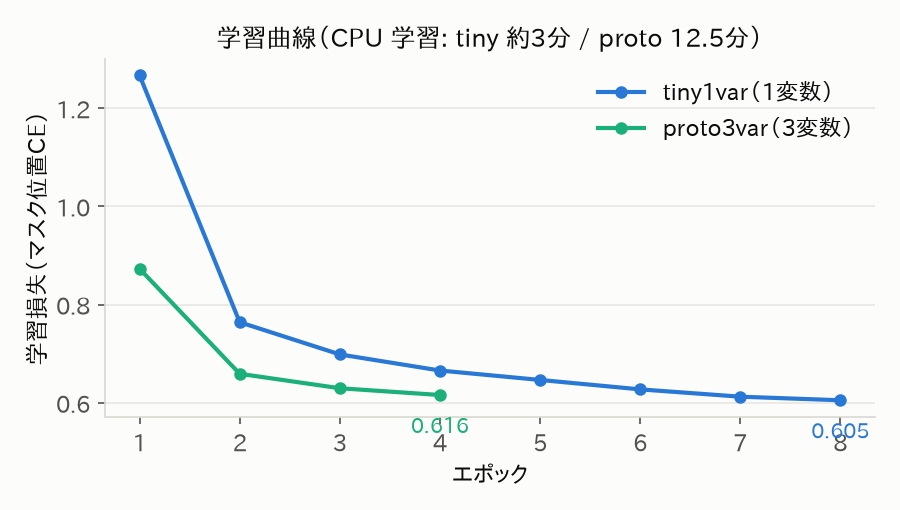
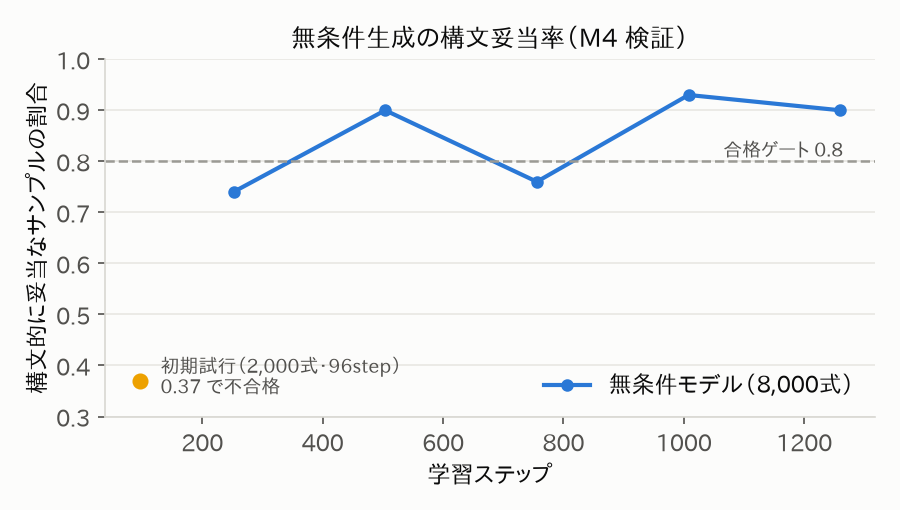
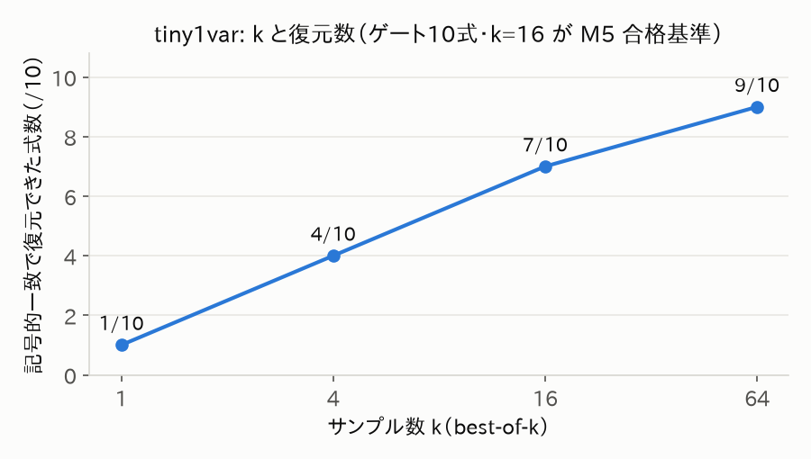
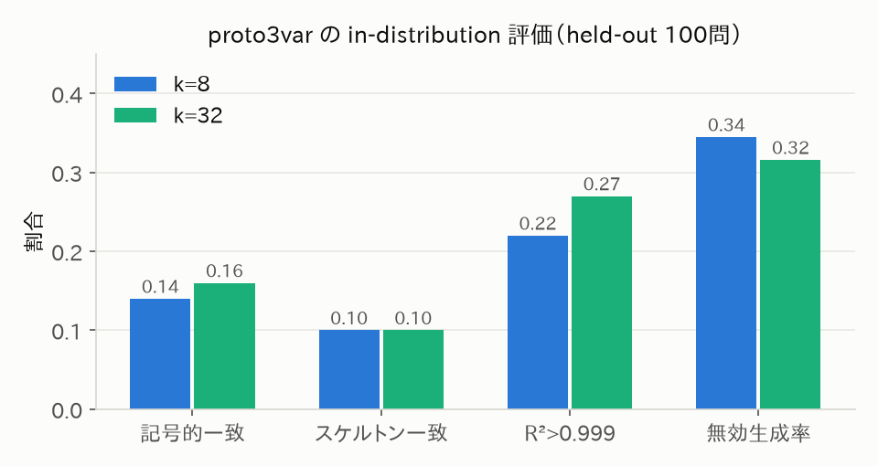
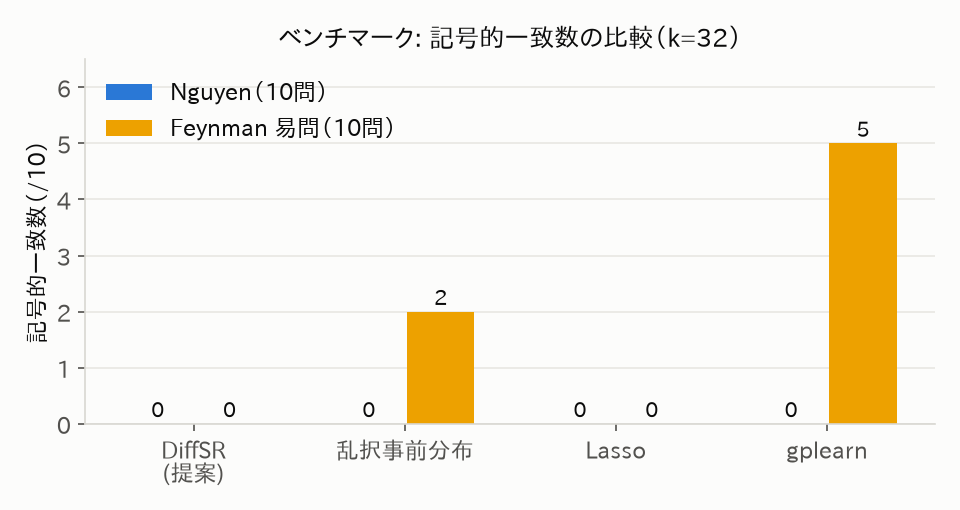
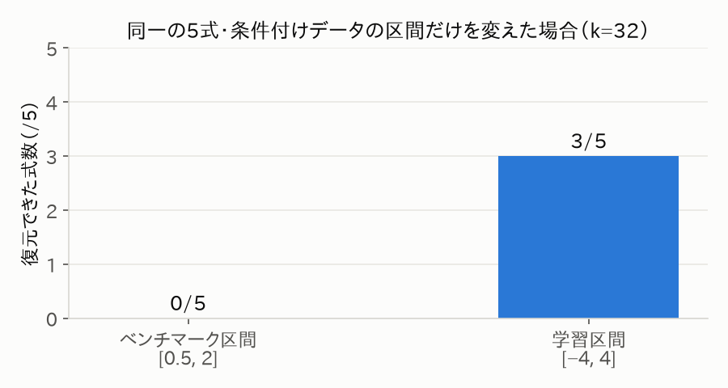
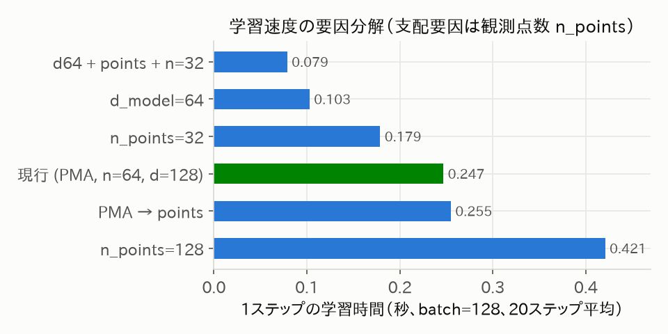

# マスク型離散拡散モデルによるシンボリック回帰：CPU規模プロトタイプでの実証と分布外汎化の分析

**2026年7月4日**
実装・実験リポジトリ: `miwamasa/unknown_unknown_with_fable5`（ブランチ `claude/agent-md-execution-kz9oei`）

---

## 要旨

観測データ (X, y) から明示的な数式を自動発見するシンボリック回帰（SR）に対し、数式を前置記法トークン列として表現し、**吸収状態（マスク型）離散拡散モデル**でデータに条件付けて生成する手法を実装・評価した。生成されるのは定数プレースホルダ `C` を含むスケルトンであり、定数は生成後に BFGS でフィッティングする。GPU を使わず CPU 4コアのみで、1変数の最小構成（学習約3分）は held-out 10式中 7〜9式を記号的一致で復元し、拡散モデルが SR の候補生成器として機能することを確認した。一方、3変数・演算子10種のプロトタイプ規模では in-distribution 一致率 0.16 にとどまり、標準ベンチマーク（Nguyen・Feynman易問）では 0/20 と、遺伝的プログラミング（gplearn、Feynman 5/10）に大きく劣った。追加実験により、この失敗の主因が探索量不足ではなく**条件付けデータの数値レンジの分布外性**であることを特定した：同一の式でも観測データを学習時と同じ区間からサンプリングすれば 3/5 が復元される。本研究は (1) マスク拡散 SR の独立実装による再現的検証、(2) best-of-k 依存性の定量化、(3) 分布外脆弱性の切り分け実験、を CPU のみの計算予算で提示するものである。

---

## 1. はじめに

### 1.1 背景

シンボリック回帰は、データに適合する**解釈可能な数式そのもの**を探索する問題であり、物理法則の発見などで応用が期待される。従来は遺伝的プログラミング（GP）系（PySR, gplearn）が主流だが、近年は大量の合成式で事前学習した Transformer によるニューラル SR（NeSymReS など）が台頭し、さらに 2025 年には**拡散言語モデル**を SR に適用する研究（DDSR、Symbolic-Diffusion）が登場した。

自己回帰型が左から右へ 1 トークンずつ生成するのに対し、離散拡散は**系列全体を並列にデノイズ**するため、生成中に常に式全体の大域的な文脈を参照できる。この性質が数式という強い構造制約を持つ系列に有利かは、まだ確立していない問いである。

### 1.2 本研究の貢献

1. **独立実装による検証**: マスク型離散拡散 SR のパイプライン（トークナイザ／条件付けエンコーダ／拡散デノイザ／BFGS 定数フィット／候補選択）を一から実装し、全工程を pytest（31件）で検証した。CPU 4コアのみで学習可能な規模設計を示した。
2. **best-of-k 依存性の定量化**: 拡散 SR は「1ショットで正解を出すモデル」ではなく「多様な候補の発生器」であり、性能が候補数 k に強く依存すること、その依存の仕方が式空間の規模で質的に変わることを示した（図3、図4）。
3. **分布外脆弱性の切り分け**: ベンチマーク全滅（0/20）の原因を、k 増加実験（k=128 でも 0/10）と条件付け区間の入れ替え実験（同一式で 0/5 → 3/5）により、**観測データの数値レンジの分布外性**に特定した（図6）。これは学習時の「式の事前分布」設計と同等以上に「X のサンプリング分布」設計が重要であることを意味する。

### 1.3 制約の明示

本研究の実行環境からは arxiv.org・huggingface.co 等への接続が遮断されており、先行研究の詳細（例: Symbolic-Diffusion の拡散カーネル種別）は検索結果の要約に基づく。確認できなかった事項は UNKNOWN として実験記録（EXPERIMENTS.md）に明記した。PySR は Julia 処理系が取得できず比較から除外し、SRSD-Feynman データセットは取得不能のため式を手動定義した（区間は独自設定）。

---

## 2. 手法

### 2.1 数式の表現

式木を**前置記法（ポーランド記法）**で直列化し、固定長 L（16〜32）まで `[PAD]` を右詰めする。語彙は二項演算子（add, sub, mul, div, pow）、単項演算子（sin, cos, exp, log, sqrt, neg）、変数 `x0..x4`、**定数プレースホルダ `C`**、小整数、特殊トークン `[PAD]`, `[MASK]` からなる。前置記法はアリティが既知なら括弧が不要で、**パースの成否がそのまま構文妥当性の判定**になる。トークナイザの往復可逆性（式→トークン→ID→式）はランダム1,000式のテストで担保した。

### 2.2 吸収状態マスク拡散

前向き過程は時刻 t ∈ (0,1] で各トークンを独立に確率 t で `[MASK]` に置換する線形スケジュール（t=1 で全マスク）。学習目的は**マスクされた位置の元トークンに対するクロスエントロピー**である（MDLM 系の時刻依存重みは原典未確認のため一様重みで簡略化。実験記録に明記）。

逆過程は全 `[MASK]` から開始し、S ステップ（20〜40）で残マスク数の目標を線形に減らしながら、**予測確信度の高い位置から順にアンマスク**する（confidence-based unmasking）。トークン値は温度付き softmax からサンプリングする。

### 2.3 データへの条件付け

観測点 {(x_i, y_i)} は点ごとに 3 特徴展開（clip(v/5), sign(v), log1p|v|）した後に埋め込み、**位置埋め込みを持たない self-attention**（順序不変）で処理する。デコーダ（causal mask なしの双方向 Transformer）は各層から条件メモリへ cross-attention する。メモリは全点をそのまま渡す方式（points）と、学習可能クエリ m=16 個へプーリングする Set Transformer 風 PMA 方式の 2 種を実装した。

### 2.4 推論パイプライン

1問題につき k 本のスケルトンを並列サンプリング → パース不能な候補を棄却（無効率を記録）→ 各候補の `C` を BFGS（マルチスタート、定義域外は有限ペナルティ）でフィット → `score = MSE + λ·複雑度` 最小の候補を採用する。

### 2.5 学習データ

Lample & Charton (2019) に準拠した予算付きランダム木で式をサンプリングし（add/mul 高頻度、div/pow 低頻度、pow の指数は小整数に制限）、定数は |c| ∈ [0.2, 5]、**X は [−4, 4] の一様分布**から生成する。非有限値・|y|>10⁴・退化（y がほぼ定数）は棄却する。この「X ∈ [−4,4]」という設計判断が後の分析（§4.4）の焦点となる。

---

## 3. 実験設定

| 項目 | tiny1var | proto3var |
|---|---|---|
| 変数数 / 演算子 | 1 / add, sub, mul, sin | 3 / 10種（div, pow, exp, log, sqrt, cos 追加） |
| 系列長 L / 内部ノード上限 | 16 / 4 | 32 / 7 |
| d_model / 層数（enc+dec） | 64 / 2+2 | 128 / 3+4 |
| エンコーダ | points | PMA |
| 学習式数 / エポック | 20,000 / 8 | 60,000 / 4 |
| 観測点数 n | 100 | 64 |
| 学習時間（CPU 4コア） | 約3分 | 12.5分 |

評価指標は (1) **記号的一致率**（フィット済み定数を整数・簡単な有理数へスナップした後、SymPy でタイムアウト付き等価判定。タイムアウトは不一致扱い＝保守的）、(2) スケルトン一致率（トークン列の完全一致、厳格）、(3) R²>0.999 達成率、(4) 無効生成率。比較対象は gplearn（GP）、線形回帰+Lasso（多項式＋初等関数の特徴量辞書）、**乱択事前分布**（学習なしで事前分布から k 本サンプル→BFGS。「条件付き拡散の寄与」を分離するアブレーション）。

学習は再現性のため全乱数をシードから決定的に導出し、同一シードでデータ・モデル初期値・サンプリングが bit 単位で再現されることをテストで確認した。

---

## 4. 結果

### 4.1 学習と構文妥当性

学習損失は両構成とも安定に減少した（図1）。無条件生成の構文妥当率は学習量に伴い上昇し、約 500 ステップ以降で 0.8〜0.93 に達した（図2）。初期試行（96 ステップ）は 0.37 で不合格だったが、これはアルゴリズムではなく単純な学習量不足であった。**文法制約なしでも、拡散モデルは前置記法の構文をおおむね学習できる**が、1割前後の無効生成は残る。

*図1: 学習曲線。CPU 4コアで tiny 約3分、proto 12.5分。*

*図2: 無条件生成の構文妥当率と学習ステップ。破線は M4 合格ゲート（0.8）。*

### 4.2 最小構成での復元性能と k 依存性

tiny1var は held-out 10式（y=2x+1, x²+x, sin(2x) など）に対し k=16 で **7/10**、k=64 で **9/10** を記号的一致で復元した（図3）。k=1 では 1/10 に過ぎない。失敗例（3sin(x) → sin(sin(x)) 等）はすべて「正しいスケルトンが k 本の中に出なかった」ケースであり、BFGS や等価判定の失敗ではなかった。

**拡散 SR の実体は「条件付き候補発生器 × 構文フィルタ × 定数フィット × 選択」のパイプラインであり、モデル単体の 1 サンプル精度は低い。** この構図は複雑度正則化 λ にほぼ無感度（λ ∈ {0, 10⁻⁴, 10⁻²} で結果不変）だった一方、k には劇的に感度がある。

*図3: tiny1var における best-of-k 曲線。*

### 4.3 プロトタイプ規模と標準ベンチマーク

proto3var の in-distribution 評価（held-out 100問）では記号的一致率 **0.16**（k=32）、R²>0.999 率 0.27 だった（図4）。注目すべきは k=8→32 の改善が +0.02 と小さいことで、tiny の急峻な k 曲線と対照的である。**式空間が拡大すると、k を増やすだけでは正解スケルトンに到達しにくくなる。**

*図4: proto3var の in-distribution 評価（100問）。*

標準ベンチマークでは DiffSR は **Nguyen 0/10、Feynman 易問 0/10** と全滅し、gplearn（Feynman 5/10）に明確に劣った（図5）。Lasso は数値精度（R²≈1.0）では最強だが記号的一致は 0 であり、**数値精度と記号的発見が別問題である**ことを端的に示す。乱択事前分布ですら Feynman で 2/10 取れることから、DiffSR は易しい式に対して「事前分布より悪い方向」へ誘導されている、すなわち条件付けが害になっている疑いが生じた。

*図5: ベンチマークにおける記号的一致数。DiffSR は 0/20。*

### 4.4 失敗の切り分け：探索不足か、分布外か

2つの追加実験で原因を特定した。

**(a) k=128 への増加**: Feynman スイートを k=128 で再実行しても **0/10 のまま**だった（R² は微増）。探索量では救えない。

**(b) 条件付け区間の入れ替え**: Feynman と同一の式（x0·x1, x0·x1·x2, 3x0·x1/2 など5式）について、観測データのサンプリング区間だけをベンチマークの [0.5, 2] から**学習時と同じ [−4, 4] に変えると 3/5 が復元**された（図6）。

*図6: 同一の5式に対し、条件付けデータの区間だけを変えた場合の復元数。*

したがってベンチマーク全滅の主因は、モデルやパイプラインの故障ではなく、**条件付けエンコーダが学習時に見た X・y の数値レンジの外で機能しない**ことにある。事前の設計段階では「式の事前分布とベンチマークのギャップ」をリスクとして認識していたが（仕様書 A3）、実際に致命的だったのは式の分布ではなく**入力数値の分布**だった。なお Nguyen-2〜4 の高次多項式（x⁴+…+x）は内部ノード数が学習事前分布の上限（7）を超えており、こちらは式の分布の問題として生成自体がほぼ不可能である。両方のギャップが重なっている。

### 4.5 計算コストの要因分解

CPU 実行の律速要因をステップ時間の直接計測で分解した（図7）。支配要因は**観測点数 n_points**（エンコーダ self-attention の O(n²)）であり、PMA プーリングの有無はほぼ中立（±3%）だった。この計測に基づき proto3var は n_points=64 に設定し、学習全体を 12.5 分に収めた。推論側の律速は拡散サンプリングではなく BFGS フィット（1問あたり約20秒@k=32）である。

*図7: 学習ステップ時間の構成別比較。緑が採用構成。*

---

## 5. 考察

### 5.1 拡散モデルは SR に「使える」のか

tiny 規模の結果（k=64 で 9/10）は、マスク拡散が条件付き式生成器として成立することを示す。ただしその価値は「多様な候補を安価に並列生成できる」点にあり、精度は後段（構文フィルタ・BFGS・選択）との組み合わせで初めて生まれる。これは先行研究 DDSR が強化学習と、Symbolic-Diffusion が大規模事前学習と組み合わせている事情とも整合的で、**拡散単体の教師あり学習＋小規模データでは、式空間の拡大に急速に追いつけなくなる**（proto の平坦な k 曲線）。

### 5.2 最大の教訓：条件付けの分布外性

本研究で最も価値のある知見は、意図せず得られた negative result である。ニューラル SR の文献では「事前学習の式分布とテスト分布のギャップ」が主に議論されるが、本実験は**観測データの数値レンジのギャップだけで性能が 3/5 → 0/5 に落ちる**ことを直接示した。対策は明確で、いずれも次段階の実装候補である：

1. **Range randomization**: 学習時に X の区間・スケール・オフセットを問題ごとにランダム化する
2. **条件付け入力の per-problem 標準化**: スケルトンの定数 `C` がスケールを吸収するため、標準化との相性が良い設計になっている
3. ベンチマーク区間を支持に含む事前分布での再学習

### 5.3 妥当性への脅威

- ベンチマークの式・区間は原典未確認の慣用値であり、Feynman サブセットの区間は独自設定である（公式 SRSD とは比較不能）
- 記号的一致判定は定数スナップ（許容誤差 10⁻³）とタイムアウトに依存し、保守的（過小評価方向）に設計している
- gplearn との比較は演算子集合を揃えたが、protected 演算の SymPy 変換を通常演算で近似しており、gplearn 側の一致数がやや甘い可能性がある
- 単一シードの結果であり、分散評価（複数シード）は未実施

---

## 6. 結論と今後の課題

CPU のみの計算予算で、マスク型離散拡散によるシンボリック回帰の end-to-end プロトタイプを実装し、(i) 小規模では記号的復元が成立すること、(ii) 性能が best-of-k に支配され、その効きが式空間の規模で減衰すること、(iii) 分布外の条件付けデータに対して脆弱であり、それがベンチマーク性能の主要な律速であること、を示した。

今後の課題は優先順に：(1) range randomization / 入力標準化による分布外頑健化、(2) 学習量・モデル容量のスケールアップ（GPU）と MDLM 系の時刻依存損失重みの導入、(3) 文法制約付きデコードによる無効生成（0.3〜0.4）の削減、(4) ノイズ付きデータへの拡張、(5) 原典確認に基づく先行研究との厳密な比較。

---

## 参考文献

原典を直接確認できた文献はない（実行環境のネットワーク制約による）。以下は検索結果の要約に基づく参照であり、書誌情報の正確性は要検証（UNKNOWN）。

1. DDSR: *Diffusion-Based Symbolic Regression*. arXiv:2505.24776 (2025).
2. *Symbolic-Diffusion: Deep Learning Based Symbolic Regression with D3PM Discrete Token Diffusion*. arXiv:2510.07570 (2025).
3. Biggio et al. *Neural Symbolic Regression that Scales*. ICML 2021, arXiv:2106.06427.
4. Kamienny et al. *End-to-end Symbolic Regression with Transformers*. NeurIPS 2022.
5. Lample & Charton. *Deep Learning for Symbolic Mathematics*. ICLR 2020, arXiv:1912.01412.
6. Austin et al. *Structured Denoising Diffusion Models in Discrete State-Spaces (D3PM)*. NeurIPS 2021.
7. Matsubara et al. *Rethinking Symbolic Regression Datasets and Benchmarks for Scientific Discovery (SRSD)*. arXiv:2206.10540.
8. Uy et al. *Semantically-based crossover in genetic programming* (Nguyen ベンチマーク). GPEM 2011.
9. La Cava et al. *SRBench: A Living Benchmark for Symbolic Regression*. NeurIPS 2021 Datasets & Benchmarks.

## 付録

- 実装・テスト・実験記録: リポジトリの `diffsr/`, `tests/`, `EXPERIMENTS.md`
- ベンチマーク詳細表（式・R²・実行時間）: `results/nguyen.md`, `results/feynman.md`, `results/feynman_k128.md`
- 図の生成スクリプト（全数値は実測値）: `paper/make_figures.py`
